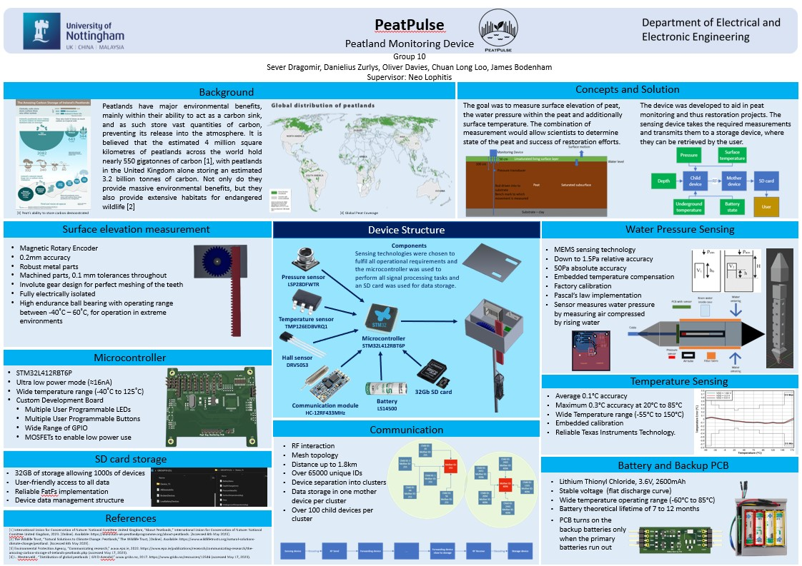

# University group project
# Peat monitoring device
### This is the repository for used for storage of all relevant resources used for the university group project. 
### The project involved development of a device that would be placed in a peat and provides measuremetns about the peat state. 
### Measurements include:
* Surface elevation - shows how much peat surface changed water in it. 
* Water pressure - shows the pressure created by the peat water table. 
* Temperature - shows temperature of surroundings around the device. 
* Operate for at least 6 months unsupervised and store all data. 
### A poster was created for the device: 
 
The respository was created and managed by Danielius Zurlys. Project work done by Danielius Zurlys: 
* All embedded software 
* Hardware and mechanical designs for pressure sensor 
* Hardware and mechanical designs for temperature sensor 
### Work done by other group members: 
* Oliver Davies - Developed PCB for STM32 
* Chuan Loo - Developed PCB for battery control 
* Sever Dragomir - Design for main case and elevantion sensor. 
* James Bodenham - RF communication hardware choice and logic 

